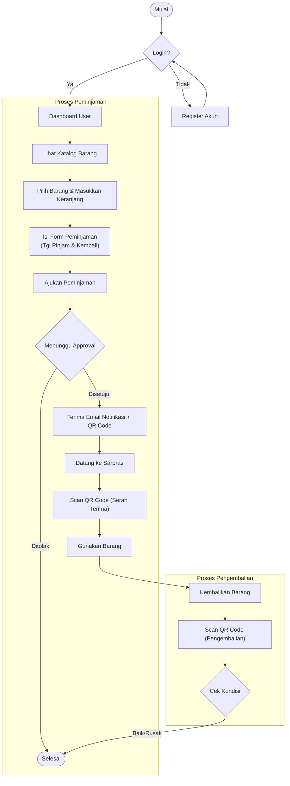
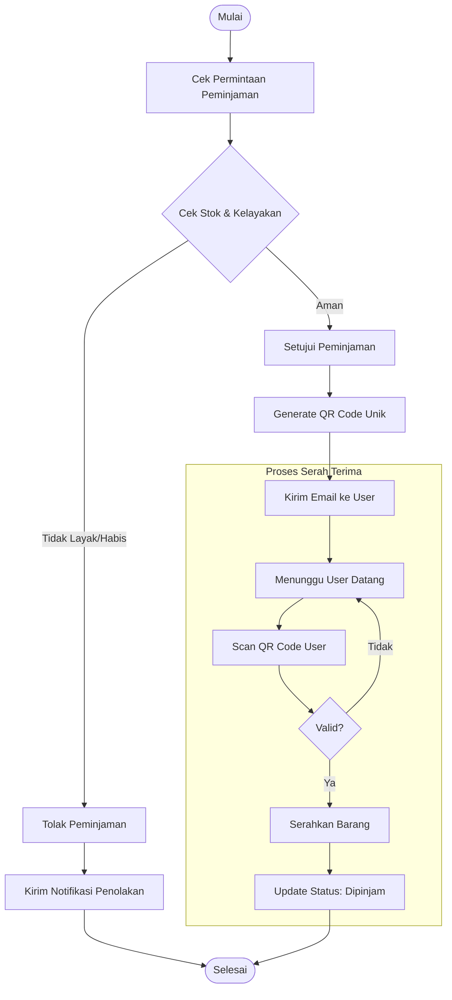
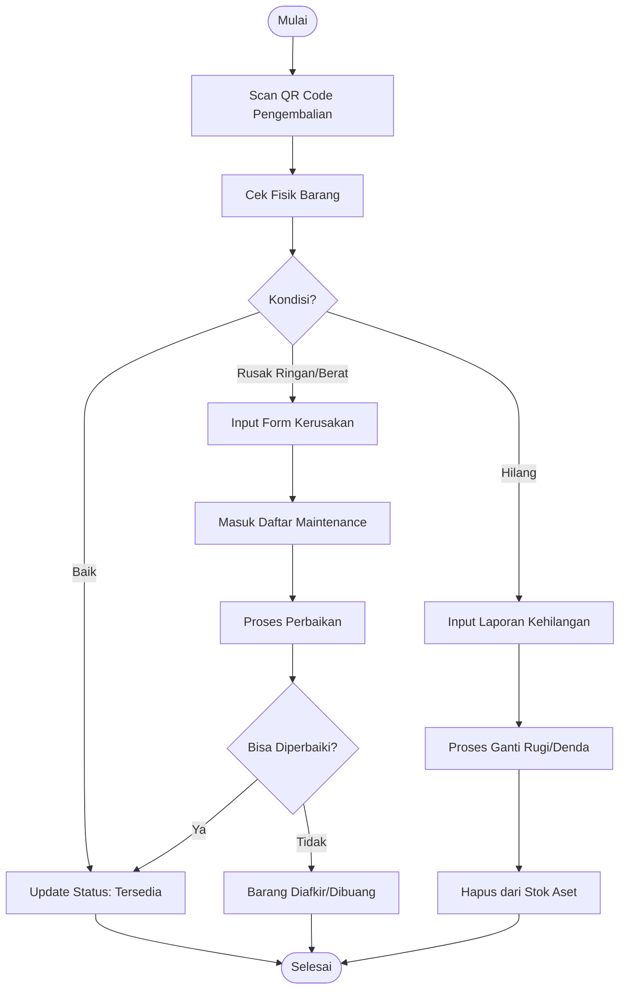
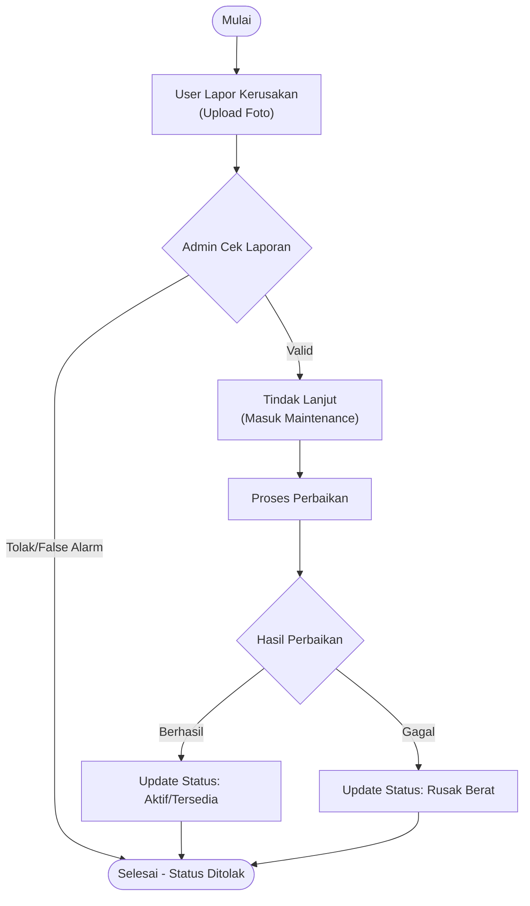

**LAPORAN UJI KOMPETENSI KEAHLIAN (UKK)**

**PENGEMBANGAN SISTEM INFORMASI SARANA DAN PRASARANA (SARPRAS) SMK NEGERI 1 BOYOLANGU**

**DISUSUN OLEH:**

**KHAIRUNNIZAM NIS/NISN : 22700.0951/** **0079715820**

**KELAS XII RPL 1**

**PROGRAM KEAHLIAN REKAYASA PERANGKAT LUNAK**

**SMK NEGERI 1 BOYOLANGU**

**2026**

**DAFTAR ISI**

[**DAFTAR ISI** 1](#_Toc221482378)

[BAB I - ANALISIS KEBUTUHAN 2](#_Toc221482379)

[1.1 Tujuan Pembuatan Aplikasi 2](#_Toc221482380)

[1.2 Permasalahan yang Diselesaikan 2](#_Toc221482381)

[1.3 Daftar Kebutuhan Fungsional 3](#_Toc221482382)

[1.4 Use Case Diagram 5](#_Toc221482383)

[1.5 Penjelasan Aktor 6](#_Toc221482384)

[BAB II - PERANCANGAN SISTEM 6](#_Toc221482385)

[2.1 Perencanaan ERD 6](#_Toc221482386)

[2.2 Penjelasan Relasi Antar Tabel 8](#_Toc221482387)

[2.3 Flowchart Sistem 8](#_Toc221482388)

[2.4 UI Mockup 11](#_Toc221482390)

[BAB III - DESKRIPSI MODUL PER HALAMAN 15](#_Toc221482391)

[3.1 Halaman Publik 15](#_Toc221482392)

[3.2 Halaman Umum (Semua Role) 15](#_Toc221482393)

[3.3 Halaman Peminjam (Guru/Siswa) 15](#_Toc221482394)

[3.4 Halaman Admin & Petugas 16](#_Toc221482395)

[3.5 Halaman Khusus Admin 17](#_Toc221482396)

[3.6 Halaman Export PDF 17](#_Toc221482397)

[BAB IV - MANUAL PENGGUNA 18](#_Toc221482398)

[4.1 Panduan Admin 18](#_Toc221482399)

[4.2 Panduan Petugas 20](#_Toc221482400)

[4.3 Panduan Guru 21](#_Toc221482401)

[4.4 Panduan Siswa 22](#_Toc221482402)

[BAB V - TEST REPORT 23](#_Toc221482403)

[5.1 Ringkasan Pengujian 23](#_Toc221482404)

[5.2Tabel Pengujian Fitur 24](#_Toc221482405)

[5.3 Screenshot Pengujian 28](#_Toc221482406)

[BAB VI - LAPORAN EVALUASI 32](#_Toc221482407)

[6.1 Fitur yang Sudah Berjalan 32](#_Toc221482408)

[6.2 Bug atau Kendala yang Ditemukan 33](#_Toc221482409)

[6.3 Rencana Pengembangan Selanjutnya 35](#_Toc221482410)

[6.4 Kesimpulan 35](#_Toc221482411)

# BAB I - ANALISIS KEBUTUHAN

## Tujuan Pembuatan Aplikasi

Aplikasi **Sistem Informasi Sarana & Prasarana SMK** dikembangkan untuk:

1.  **Digitalisasi Pengelolaan Inventaris** - Menggantikan pencatatan manual inventaris sekolah dengan sistem digital yang terintegrasi
2.  **Efisiensi Proses Peminjaman** - Mempercepat dan menyederhanakan proses peminjaman barang dengan sistem QR Code
3.  **Transparansi & Akuntabilitas** - Menyediakan tracking lengkap untuk setiap transaksi peminjaman dan pengembalian
4.  **Monitoring Real-time** - Memantau kondisi dan ketersediaan aset sekolah secara real-time
5.  **Pelaporan Kerusakan** - Menyediakan kanal pengaduan kerusakan yang terstruktur

## Permasalahan yang Diselesaikan

|     |     |     |
| --- | --- | --- |
| No  | Permasalahan | Solusi yang Ditawarkan |
| 1   | Pencatatan inventaris manual rentan error | Database terpusat dengan tracking unit individu |
| 2   | Proses peminjaman tidak transparan | Sistem approval dengan notifikasi dan QR Code |
| 3   | Sulit melacak kondisi aset | Status kondisi real-time (baik/rusak ringan/rusak berat) |
| 4   | Tidak ada histori peminjaman | Log lengkap setiap transaksi dengan foto dokumentasi |
| 5   | Laporan kerusakan sulit diproses | Sistem pengaduan dengan workflow status |
| 6   | Tidak ada alert stok menipis | Dashboard dengan notifikasi otomatis |

## Daftar Kebutuhan Fungsional

### A. Modul Autentikasi & User Management

- Login menggunakan NISN/NIP dan password
- Registrasi dengan validasi whitelist
- Multi-role: Admin, Petugas, Guru, Siswa
- CRUD user oleh Admin
- Soft delete untuk pengamanan data

### B. Modul Master Data

- CRUD Kategori barang
- CRUD Lokasi/Ruangan (dengan konsep Storefront)
- CRUD Sarpras (Aset & Bahan Habis Pakai)
- CRUD Unit per Sarpras
- Upload foto sarpras

### C. Modul Peminjaman

- Katalog barang dengan filter kategori/lokasi
- Pengajuan peminjaman oleh Guru/Siswa
- Approval/Reject oleh Admin/Petugas
- Generate QR Code unik per peminjaman
- Proses serah terima (handover) dengan foto
- Email notifikasi dengan QR Code

### D. Modul Pengembalian

- Scan QR Code untuk verifikasi
- Input kondisi pengembalian (baik/rusak)
- Upload foto bukti pengembalian
- Update status unit otomatis

### E. Modul Pengaduan (Maintenance Report)

- Laporan kerusakan oleh user
- Upload foto kerusakan
- Workflow status: Pending → Proses → Selesai
- Catatan tindak lanjut

### F. Modul Maintenance

- Pencatatan perbaikan unit
- Tracking riwayat maintenance per unit
- Update kondisi setelah perbaikan

### G. Modul Laporan & Monitoring

- Dashboard statistik
- Export PDF: Peminjaman, Barang Hilang, Maintenance, Sarpras
- Activity Log untuk audit trail
- Asset Health Report

## Use Case Diagram

## Penjelasan Aktor

|     |     |
| --- | --- |
| **Aktor** | **Fungsi & Hak Akses** |
| Admin | Akses penuh ke seluruh sistem. Mengelola master data (lokasi, kategori, sarpras, user), approval peminjaman, proses pengembalian, export laporan, dan melihat activity log |
| Petugas | Fokus pada operasional harian. Approval peminjaman, proses serah terima, pengembalian, kelola sarpras & unit, dan export laporan |
| Guru | Peminjam dengan akses ke katalaog, dapat meminjam semua jenis barang termasuk bahan habis pakai, mengajukan pengaduan kerusakan |
| Siswa | Peminjam dengan akses ke katalaog, dapat meminjam 1 jenis barang, mengajukan pengaduan kerusakan |

# BAB II - PERANCANGAN SISTEM

## 2.1 Perencanaan ERD

2.1 Entity Relationship Diagram (ERD)

## 2.2 Penjelasan Relasi Antar Tabel

|     |     |     |
| --- | --- | --- |
| **Relasi** | **Tipe** | **Penjelasan** |
| users → peminjaman | One-to-Many | Satu user dapat memiliki banyak riwayat peminjaman |
| kategori → sarpras | One-to-Many | Satu kategori (misal: Elektronik) membawahi banyak jenis barang |
| sarpras → sarpras_units | One-to-Many | Satu jenis barang (misal: Laptop Dell) memiliki banyak unit individu |
| sarpras → item_stocks | One-to-Many | Barang habis pakai memiliki stok jumlah di tiap lokasi berbeda |
| lokasi → sarpras_units | One-to-Many | Satu ruangan menyimpan banyak unit barang |
| peminjaman → peminjaman_details | One-to-Many | Satu transaksi peminjaman bisa terdiri dari banyak barang |
| sarpras_units → peminjaman_details | One-to-Many | Satu unit barang spesifik tercatat dalam detail peminjaman |
| peminjaman → pengembalian | One-to-One | Setiap satu peminjaman hanya memiliki satu form pengembalian |

## 2.3 Flowchart Sistem

Berikut adalah alur kerja sistem yang dibagi berdasarkan peran pengguna dan jenis proses.

### A. Flowchart User (Siswa/Guru)
Menjelaskan alur peminjaman dari sisi pengguna, termasuk penerimaan QR Code.

### B. Flowchart Admin - Approval & Serah Terima
Menjelaskan proses validasi peminjaman dan serah terima barang (Handover).

### C. Flowchart Admin - Pengembalian & Denda
Menjelaskan proses pengembalian barang, pengecekan kondisi, dan penanganan barang hilang/rusak.

### D. Flowchart Maintenance & Pengaduan
Menjelaskan alur pelaporan kerusakan dan tindak lanjut perbaikan.

## 2.4 UI Mockup

### Halaman Login

|     |     |
| --- | --- |
| Elemen | Fungsi |
| Input NISN/NIP | Autentikasi menggunakan nomor induk |
| Input Password | Password untuk verifikasi |
| Tombol “Masuk” | Submit form login |
| Link “Daftar” | Navigasi ke halaman registrasi |

### Dashboard Admin

|     |     |
| --- | --- |
| Elemen | Fungsi |
| Statistik Cards | Menampilkan total peminjaman, sarpras, user, pengaduan |
| Grafik Peminjaman | Visualisasi tren peminjaman bulanan |
| Widget Alert | Notifikasi stok menipis, barang overdue |
| Quick Actions | Shortcut ke fitur utama |

### Halaman Katalog

|     |     |
| --- | --- |
| Elemen | Fungsi |
| Search Bar | Pencarian barang berdasarkan nama |
| Filter Kategori | Dropdown filter kategori |
| Filter Lokasi | Dropdown filter lokasi |
| Card Barang | Menampilkan foto, nama, stok tersedia |
| Tombol “Pinjam” | Navigasi ke form peminjaman |

### Halaman Form Peminjaman

|     |     |
| --- | --- |
| Elemen | Fungsi |
| List Barang Dipilih | Daftar unit yang akan dipinjam |
| Input Tanggal Pinjam | Pilih tanggal mulai pinjam |
| Input Tanggal Kembali | Pilih tanggal rencana kembali |
| Textarea Keterangan | Alasan/tujuan peminjaman |
| Tombol “Ajukan” | Submit pengajuan peminjaman |
| Search Bar | Pencarian barang berdasarkan nama |
| Filter Kategori | Dropdown filter kategori |

# 

# BAB III - DESKRIPSI MODUL PER HALAMAN

## 3.1 Halaman Publik

|     |     |     |
| --- | --- | --- |
| Halaman | URL | Fungsi |
| **Login** | /login | Autentikasi pengguna dengan NISN/NIP dan password |
| **Register** | /register | Pendaftaran akun baru dengan validasi whitelist |

## 3.2 Halaman Umum (Semua Role)

|     |     |     |
| --- | --- | --- |
| Halaman | URL | Fungsi |
| **Dashboard** | /dashboard | Menampilkan ringkasan statistik sesuai role pengguna |
| **Profile** | /profile | Mengelola data profil dan ganti password |
| **Notifikasi** | /notifications | Daftar notifikasi (approval, reminder, dll) |

## 3.3 Halaman Peminjam (Guru/Siswa)

|     |     |     |
| --- | --- | --- |
| Halaman | URL | Fungsi |
| **Katalog** | /katalog | Browsing barang tersedia dengan filter dan search |
| **Form Peminjaman** | /peminjaman/create | Form pengajuan peminjaman barang |
| **Riwayat Peminjaman** | /peminjaman | Daftar semua peminjaman milik user |
| **Detail Peminjaman** | /peminjaman/{id} | Detail lengkap satu peminjaman dengan QR Code |
| **Form Pengaduan** | /pengaduan/create | Form laporan kerusakan sarpras |
| **Riwayat Pengaduan** | /pengaduan | Daftar pengaduan yang pernah dibuat |

## 3.4 Halaman Admin & Petugas

|     |     |     |
| --- | --- | --- |
| Halaman | URL | Fungsi |
| **Daftar Sarpras** | /sarpras | Kelola master data barang |
| **Form Sarpras** | /sarpras/create, /sarpras/{id}/edit | Tambah/edit data sarpras |
| **Detail Sarpras** | /sarpras/{id} | Lihat detail dan unit per sarpras |
| **Daftar Unit** | /sarpras/{id}/units | Kelola unit individu per sarpras |
| **Daftar Peminjaman** | /peminjaman | Semua peminjaman dengan filter status |
| **Approval Peminjaman** | /peminjaman/{id}/edit | Approve/reject peminjaman |
| **Handover** | /peminjaman/{id}/handover | Proses serah terima barang |
| **Form Pengembalian** | /pengembalian/{id}/create | Input pengembalian dengan kondisi |
| **Daftar Pengaduan** | /pengaduan | Semua laporan pengaduan |
| **Edit Pengaduan** | /pengaduan/{id}/edit | Update status pengaduan |
| **Daftar Maintenance** | /maintenance | Riwayat perbaikan unit |
| **Form Maintenance** | /maintenance/create | Input maintenance baru |
| **Barang Hilang** | /barang-hilang | Daftar barang yang hilang |
| **Barang Rusak** | /barang-rusak | Daftar barang rusak berat |

## 3.5 Halaman Khusus Admin

|     |     |     |
| --- | --- | --- |
| Halaman | URL | Fungsi |
| **Daftar User** | /users | Kelola semua pengguna sistem |
| **Form User** | /users/create, /users/{id}/edit | Tambah/edit user |
| **Daftar Lokasi** | /lokasi | Kelola master lokasi/ruangan |
| **Form Lokasi** | /lokasi/create, /lokasi/{id}/edit | Tambah/edit lokasi |
| **Daftar Kategori** | /kategori | Kelola kategori barang |
| **Form Kategori** | /kategori/create, /kategori/{id}/edit | Tambah/edit kategori |
| **Whitelist** | /whitelist | Kelola daftar NISN/NIP yang boleh register |
| **Import Whitelist** | /whitelist/import | Upload CSV/Excel whitelist |
| **Activity Log** | /activity-logs | Audit trail semua aktivitas |
| **Trash** | /trash | Kelola data yang sudah dihapus (soft delete) |
| **Laporan Asset Health** | /laporan/asset-health | Laporan kondisi aset keseluruhan |

## 3.6 Halaman Export PDF

|     |     |     |
| --- | --- | --- |
| Halaman | URL | Fungsi |
| **Export Peminjaman** | /export/peminjaman | Generate PDF daftar peminjaman |
| **Export Barang Hilang** | /export/barang-hilang | Generate PDF barang hilang |
| **Export Maintenance** | /export/maintenance | Generate PDF riwayat maintenance |
| **Export Sarpras** | /export/sarpras | Generate PDF master sarpras |
| **Export Activity Log** | /export/activity-logs | Generate PDF activity log |
| **Export Asset Health** | /export/asset-health | Generate PDF laporan kesehatan aset |

# BAB IV - MANUAL PENGGUNA

## 4.1 Panduan Admin

### A. Login ke Sistem

1.  Buka aplikasi di browser
2.  Masukkan **NIP/Gmail** pada kolom NISN/NIP
3.  Masukkan **Password**
4.  Klik tombol **“Masuk”**
5.  Anda akan diarahkan ke Dashboard Admin

### B. Mengelola Master Data Sarpras

1.  Klik menu **“Sarpras”** di sidebar
2.  Untuk menambah: Klik tombol **“+ Tambah Sarpras”**
3.  Isi form:
    - Kode Barang (unik)
    - Nama Barang
    - Pilih Kategori
    - Pilih Tipe (Aset/Bahan Habis Pakai)
    - Upload Foto (opsional)
    - Deskripsi (opsional)
4.  Klik **“Simpan”**
5.  Setelah sarpras dibuat, tambahkan unit dengan klik **“Kelola Unit”**

### C. Mengelola User

1.  Klik menu **“User”** di sidebar
2.  Untuk menambah: Klik **“+ Tambah User”**
3.  Isi data: Nama, NISN/NIP, Email, Role, Password
4.  Klik **“Simpan”**

### D. Approval Peminjaman

1.  Klik menu **“Peminjaman”**
2.  Filter status **“Menunggu”**
3.  Klik peminjaman yang ingin diproses
4.  Review detail peminjaman
5.  Pilih unit yang akan dipinjamkan (atau auto-assign)
6.  Klik **“Setujui”** atau **“Tolak”** (dengan alasan)

### E. Proses Pengembalian

1.  Klik menu **“Peminjaman”**
2.  Filter status **“Dipinjam”**
3.  Pilih peminjaman yang akan dikembalikan
4.  Klik **“Proses Pengembalian”**
5.  Scan QR Code atau input manual
6.  Periksa dan input kondisi tiap unit
7.  Upload foto bukti pengembalian
8.  Klik **“Selesai”**

### F. Export Laporan

1.  Klik menu **“Export”** di sidebar
2.  Pilih jenis laporan yang diinginkan
3.  Atur filter tanggal (jika ada)
4.  Klik **“Download PDF”**

### G. Logout

1.  Klik nama/ikon profil di pojok kanan atas
2.  Pilih **“Logout”**

## 4.2 Panduan Petugas

### A. Login ke Sistem

1.  Buka aplikasi di browser
2.  Masukkan **NIP** pada kolom NISN/NIP
3.  Masukkan **Password**
4.  Klik **“Masuk”**

### B. Approval Peminjaman

(Sama dengan langkah Admin D)

### C. Proses Serah Terima (Handover)

1.  Klik menu **“Peminjaman”**
2.  Filter status **“Disetujui”**
3.  Pilih peminjaman yang siap diambil
4.  Klik **“Handover”**
5.  Verifikasi unit yang diserahkan
6.  Upload foto bukti serah terima
7.  Klik **“Konfirmasi Serah Terima”**

### D. Proses Pengembalian

(Sama dengan langkah Admin E)

### E. Mengelola Sarpras & Unit

1.  Klik menu **“Sarpras”**
2.  Pilih sarpras yang ingin dikelola
3.  Klik **“Kelola Unit”** untuk menambah/edit unit

### F. Logout

1.  Klik profil → **“Logout”**

## 4.3 Panduan Guru

### A. Login ke Sistem

1.  Buka aplikasi di browser
2.  Masukkan **NIP** pada kolom NISN/NIP
3.  Masukkan **Password**
4.  Klik **“Masuk”**

### B. Melihat Katalog Barang

1.  Klik menu **“Katalog”** di sidebar
2.  Gunakan search bar untuk mencari barang
3.  Gunakan filter kategori/lokasi jika diperlukan
4.  Klik barang untuk melihat detail

### C. Mengajukan Peminjaman

1.  Di halaman Katalog, klik **“Pinjam”** pada barang yang diinginkan
2.  Atau klik menu **“Ajukan Peminjaman”**
3.  Pilih barang dan jumlah yang ingin dipinjam
4.  Isi tanggal pinjam dan tanggal kembali rencana
5.  Isi keterangan/tujuan peminjaman
6.  Klik **“Ajukan Peminjaman”**
7.  Tunggu approval dari Admin/Petugas

### D. Mengambil Barang yang Disetujui

1.  Cek email untuk QR Code
2.  Datang ke ruang inventaris
3.  Tunjukkan QR Code ke Petugas
4.  Petugas akan memproses serah terima
5.  Tanda tangani (jika diperlukan)

### E. Melaporkan Kerusakan

1.  Klik menu **“Pengaduan”**
2.  Klik **“+ Buat Pengaduan”**
3.  Pilih jenis pengaduan (Sarpras/Lainnya)
4.  Isi deskripsi kerusakan
5.  Upload foto kerusakan
6.  Klik **“Kirim”**

### F. Logout

1.  Klik profil → **“Logout”**

## 4.4 Panduan Siswa

### A. Registrasi Akun

1.  Buka aplikasi di browser
2.  Klik **“Daftar di sini”**
3.  Masukkan **NISN** (harus terdaftar di whitelist)
4.  Isi data: Nama, Email, Password
5.  Klik **“Daftar”**
6.  Login dengan NISN dan password

### B. Login ke Sistem

1.  Masukkan **NISN** pada kolom NISN/NIP
2.  Masukkan **Password**
3.  Klik **“Masuk”**

### C. Melihat Katalog Barang

(Sama dengan langkah Guru B)

**Catatan**: Siswa hanya dapat melihat dan meminjam barang tipe **Aset**, tidak termasuk **Bahan Habis Pakai**

### D. Mengajukan Peminjaman

(Sama dengan langkah Guru C)

### E. Mengambil Barang

(Sama dengan langkah Guru D)

### F. Melaporkan Kerusakan

(Sama dengan langkah Guru E)

### G. Logout

1.  Klik profil → **“Logout”**

# BAB V - TEST REPORT

## 5.1 Ringkasan Pengujian

|     |     |     |     |     |
| --- | --- | --- | --- | --- |
| Kategori | Jumlah Test Case | Pass | Fail | Skip |
| Autentikasi | 7   | 7   | 0   | 0   |
| Master Data | 7   | 7   | 0   | 0   |
| Peminjaman | 10  | 10  | 0   | 0   |
| Pengembalian | 7   | 7   | 0   | 0   |
| Pengaduan | 5   | 5   | 0   | 0   |
| Laporan | 6   | 6   | 0   | 0   |
| Sistem | 5   | 5   | 0   | 0   |
| **Total** | **47** | **47** | **0** | **0** |

## Tabel Pengujian Fitur

### A. Modul Autentikasi

|     |     |     |     |     |     |
| --- | --- | --- | --- | --- | --- |
| **ID** | **Fitur** | **Test Case** | **Expected Result** | **Actual Result** | **Status** |
| T1-AUTH-001 | Login | Login dengan NISN/NIP & password valid | Redirect ke dashboard sesuai role | Redirect Sukses | ✅Pass |
| T1-AUTH-002 | Login | Login dengan password salah | Error message, tidak ada session | Muncul Error | ✅Pass |
| T1-AUTH-003 | Logout | Klik logout | Session terhapus, redirect ke login | Logout Sukses | ✅Pass |
| T1-AUTH-004 | CRUD User | Admin create user baru | User tersimpan, bisa login | User Terbuat | ✅Pass |
| T1-AUTH-005 | CRUD User | Admin edit data user | Data terupdate | Data Berubah | ✅Pass |
| T1-AUTH-006 | CRUD User | Admin delete user | User soft deleted | User Terhapus | ✅Pass |
| T1-AUTH-007 | Ganti Password | User ganti password | Password lama tidak valid | Password Diganti | ✅Pass |

### 

### B. Modul Master Data

|     |     |     |     |     |     |
| --- | --- | --- | --- | --- | --- |
| ID  | Fitur | Test Case | Expected Result | Actual Result | Status |
| T1-MASTER-001 | Kategori | Admin tambah kategori | Kategori muncul di dropdown | Muncul | ✅Pass |
| T1-MASTER-002 | Kategori | Admin edit kategori | Nama berubah | Nama Berubah | ✅Pass |
| T1-MASTER-003 | Kategori | Admin hapus kategori | Kategori tidak muncul | Hilang | ✅Pass |
| T1-MASTER-004 | Sarpras | Admin create sarpras | Record tersimpan lengkap | Tersimpan | ✅Pass |
| T1-MASTER-005 | Sarpras | Admin edit sarpras | Data berubah | Data Berubah | ✅Pass |
| T1-MASTER-006 | Sarpras | Admin delete sarpras | Sarpras soft deleted | Terhapus | ✅Pass |
| T1-MASTER-007 | View | User lihat daftar sarpras | List tampil dengan info lengkap | Tampil Lengkap | ✅Pass |

### C. Modul Peminjaman

|     |     |     |     |     |     |
| --- | --- | --- | --- | --- | --- |
| ID  | Fitur | Test Case | Expected Result | Actual Result | Status |
| T1-PINJAM-001 | Katalog | User buka katalog | Hanya barang stok > 0 | Sesuai | ✅Pass |
| T1-PINJAM-002 | Ajukan | User ajukan peminjaman | Status “Menunggu” | Status Menunggu | ✅Pass |
| T1-PINJAM-003 | Validasi | Tanggal kembali < tanggal pinjam | Form ditolak | Ditolak | ✅Pass |
| T1-PINJAM-004 | Riwayat | User lihat riwayat | Semua peminjaman tampil | Tampil Semua | ✅Pass |
| T1-PINJAM-005 | Approve | Admin approve | Status “Disetujui” + QR Code | QR Muncul | ✅Pass |
| T1-PINJAM-006 | Reject | Admin reject | Status “Ditolak” + alasan | Ditolak | ✅Pass |
| T1-PINJAM-007 | QR Code | Cetak bukti | QR Code dapat di-scan | Bisa Scan | ✅Pass |
| T1-PINJAM-008 | Stok | Booking double | Sistem mencegah overlapping | Dicegah | ✅Pass |
| T1-PINJAM-009 | List | Admin lihat peminjaman aktif | Filter berfungsi | Berfungsi | ✅Pass |
| T1-PINJAM-010 | Stok Auto | Approve & kembalikan | Stok berkurang & bertambah | Sesuai | ✅Pass |

### 

### D. Modul Pengembalian

|     |     |     |     |     |     |
| --- | --- | --- | --- | --- | --- |
| ID  | Fitur | Test Case | Expected Result | Actual Result | Status |
| T1-KEMBALI-001 | Scan QR | Petugas scan QR | Form terisi otomatis | Terisi | ✅Pass |
| T1-KEMBALI-002 | Kondisi | Input kondisi: Baik/Rusak/Hilang | Status tersimpan | Tersimpan | ✅Pass |
| T1-KEMBALI-003 | Kerusakan | Isi deskripsi kerusakan | Catatan tersimpan | Tersimpan | ✅Pass |
| T1-KEMBALI-004 | Foto | Upload foto kondisi | Foto tersimpan | Tersimpan | ✅Pass |
| T1-KEMBALI-005 | Riwayat | Lihat riwayat pengembalian | List tampil lengkap | Tampil | ✅Pass |
| T1-KEMBALI-006 | Update | Kondisi master ter-update | Field berubah | Berubah | ✅Pass |
| T1-KEMBALI-007 | Hilang | Tandai hilang | Flag hilang aktif | Aktif | ✅Pass |

### E. Modul Pengaduan

|     |     |     |     |     |     |
| --- | --- | --- | --- | --- | --- |
| ID  | Fitur | Test Case | Expected Result | Actual Result | Status |
| T1-ADUAN-001 | Ajukan | User ajukan pengaduan | Status “Belum Ditindaklanjuti” | Sesuai | ✅Pass |
| T1-ADUAN-002 | Riwayat | User lihat riwayat | Hanya miliknya | Sesuai | ✅Pass |
| T1-ADUAN-003 | List | Admin lihat semua | Filter berfungsi | Berfungsi | ✅Pass |
| T1-ADUAN-004 | Status | Admin ubah status | Status berubah | Berubah | ✅Pass |
| T1-ADUAN-005 | Catatan | Admin tambah catatan | Catatan tersimpan | Tersimpan | ✅Pass |

## 5.3 Screenshot Pengujian

|     |     |     |
| --- | --- | --- |
| Test ID | Deskripsi | Screenshot |
| T1-AUTH-001 | Halaman Login (Tampilan Awal) |     |
| T1-AUTH-002 | Alert Login Gagal (Password Salah) |     |
| T1-AUTH-003 | Dashboard Admin |     |
| T1-MASTER-001 | Halaman Daftar Sarpras |     |
| T1-MASTER-004 | Form Tambah Barang Baru |     |
| T1-MASTER-007 | Halaman Detail Barang & Unit |     |
| T1-PINJAM-001 | Katalog Peminjaman (Sisi Guru/Siswa) |     |
| T1-PINJAM-002 | Form Pengajuan Peminjaman |     |
| T1-PINJAM-005 | Halaman Approval Peminjaman (Admin) |     |
| T1-PINJAM-007 | Tampilan Email Notifikasi & QR Code di HP |     |
| T1-PINJAM-009 | Detail Peminjaman (Status Disetujui) |     |
| T1-KEMBALI-001 | Form Scan QR Pengembalian |     |
| T1-KEMBALI-002 | Form Cek Kondisi Barang (Rusak/Baik) |     |
| T1-KEMBALI-005 | Riwayat Pengembalian Selesai |     |
| T1-ADUAN-001 | Form Lapor Kerusakan |     |
| T1-ADUAN-003 | Daftar Pengaduan Masuk (Admin) |     |

# 

# BAB VI - LAPORAN EVALUASI

## 6.1 Fitur yang Sudah Berjalan

### ✅ Tier 1 - Fitur Utama

|     |     |     |     |
| --- | --- | --- | --- |
| No  | Modul | Fitur | Status |
| 1   | Autentikasi | Login/Logout dengan NISN/NIP | ✅ Berjalan |
| 2   | Autentikasi | Multi-role (Admin, Petugas, Guru, Siswa) | ✅ Berjalan |
| 3   | Autentikasi | Registrasi dengan Whitelist | ✅ Berjalan |
| 4   | Master Data | CRUD Kategori | ✅ Berjalan |
| 5   | Master Data | CRUD Lokasi dengan Storefront | ✅ Berjalan |
| 6   | Master Data | CRUD Sarpras (Aset & Bahan) | ✅ Berjalan |
| 7   | Master Data | CRUD Unit per Sarpras | ✅ Berjalan |
| 8   | Peminjaman | Katalog dengan filter & search | ✅ Berjalan |
| 9   | Peminjaman | Pengajuan peminjaman | ✅ Berjalan |
| 10  | Peminjaman | Approval/Reject | ✅ Berjalan |
| 11  | Peminjaman | Generate QR Code | ✅ Berjalan |
| 12  | Peminjaman | Proses Handover | ✅ Berjalan |
| 13  | Pengembalian | Scan QR untuk verifikasi | ✅ Berjalan |
| 14  | Pengembalian | Input kondisi & foto | ✅ Berjalan |
| 15  | Pengembalian | Update status otomatis | ✅ Berjalan |
| 16  | Pengaduan | Laporan kerusakan | ✅ Berjalan |
| 17  | Pengaduan | Workflow status | ✅ Berjalan |
| 18  | Maintenance | Pencatatan perbaikan | ✅ Berjalan |
| 19  | Laporan | Dashboard statistik | ✅ Berjalan |
| 20  | Laporan | Export PDF | ✅ Berjalan |
| 21  | Laporan | Activity Log | ✅ Berjalan |
| 22  | Sistem | Soft Delete | ✅ Berjalan |
| 23  | Sistem | Trash & Restore | ✅ Berjalan |

### ✅ Tier 2 - Fitur Tambahan

|     |     |     |
| --- | --- | --- |
| No  | Fitur | Status |
| 1   | Email notifikasi dengan QR Code | ✅ Berjalan |
| 2   | Asset Health Report | ✅ Berjalan |
| 3   | Hybrid inventory (Aset + Bahan Habis Pakai) | ✅ Berjalan |

## 6.2 Bug atau Kendala yang Ditemukan

|     |     |     |     |     |
| --- | --- | --- | --- | --- |
| No  | Kendala | Severity | Status | Solusi |
| 1   | **Gagal Koneksi Database (Error 500)** | High | ✅ Solved | Menyesuaikan konfigurasi file .env dengan database lokal (XAMPP/Laragon) |
| 2   | **Gambar Tidak Muncul Setelah Upload** | Medium | ✅ Solved | Menjalankan perintah php artisan storage:link di terminal |
| 3   | **Stok Minus saat Banyak yang Akses** | High | ✅ Solved | Menambahkan sistem pengecekan stok ganda sebelum simpan data |
| 5   | **Siswa Bisa Buka Halaman Admin** | Critical | ✅ Solved | Menambahkan pengecekan hak akses (role) di setiap halaman admin |
| 6   | **Gagal Upload Foto Ukuran Besar** | Medium | ✅ Solved | Membatasi ukuran foto maksimal 2MB dan memberi pesan peringatan |
| 7   | **Email Notifikasi Masuk Spam** | Low | ✅ Solved | Sementara menandai bukan spam manual |

## 

## 6.3 Rencana Pengembangan Selanjutnya

|     |     |     |     |
| --- | --- | --- | --- |
| No  | Fitur | Prioritas | Keterangan |
| 1   | **Notifikasi WhatsApp/Telegram** | High | Integrasi dengan API messaging untuk reminder jatuh tempo |
| 3   | **Prediksi Kerusakan (AI)** | Low | Analisis pola untuk prediksi aset berisiko rusak |
| 4   | **Cloud Storage untuk Foto** | Medium | Upload ke S3/GCS untuk skalabilitas |
| 5   | **Mobile App** | High | Aplikasi Android/iOS untuk akses mobile |
| 6   | **Granular RBAC** | Low | Role dan permission yang lebih detail |
| 7   | **Laporan Lifecycle Aset** | Medium | Tracking umur aset dan rekomendasi replace |
| 8   | **Security Hardening** | High | Audit keamanan dan perbaikan vulnerability |

## 6.4 Kesimpulan

Aplikasi Sistem Informasi Sarana & Prasarana SMK telah berhasil dikembangkan sebagai solusi digital yang mencakup:

- Digitalisasi Inventaris: Menggantikan pencatatan manual buku menjadi sistem database terpusat yang aman.
- Kemudahan Akses: Multi-role (Admin, Petugas, Guru, Siswa) dapat mengakses sistem sesuai kebutuhan masing-masing.
- Efisiensi Layanan: Proses peminjaman dan pengembalian barang menjadi lebih cepat dengan teknologi QR Code.
- Transparansi: Setiap pergerakan barang (dipinjam, rusak, diperbaiki) tercatat otomatis dan dapat diaudit.
- Dokumentasi Rapi: Laporan kondisi aset dan riwayat transaksi dapat dicetak kapan saja dalam format PDF.
- Dengan sistem ini, pengelolaan aset sekolah menjadi lebih terkontrol, cepat, dan akuntabel dibanding sebelumnya.

# **LEMBAR PENGESAHAN**

**Laporan ini Disampaikan untuk Memenuhi Persyaratan**

**Penyelesaian UKK MANDIRI REKAYASA PERANGKAT LUNAK**

**SMK NEGERI 1 BOYOLANGU**

**Tahun pelajaran 2025/2026**

  
Disusun Oleh :

|     |     |     |
| --- | --- | --- |
| **1.KHAIRUNNIZAM** |     | **NIS. 22700 / 0951** |

  
Tulungagung, Februari 2026

Mengetahui dan Menyetujui  
 Menyetujui,

Kepala Jurusan

**KURNILA PUTRI ISLAMAWATI, S.Pd**

NIP. 19970318 202221 2 010

  
Penguji UKK Internal

Penguji UKK Internal

**ARIEF ANDRIYAN SYAHRUL MAHDI, A.Md**

**RULY DWI SETYANINGRUM S.Kom**

NIP. 19771112 202221 1 007